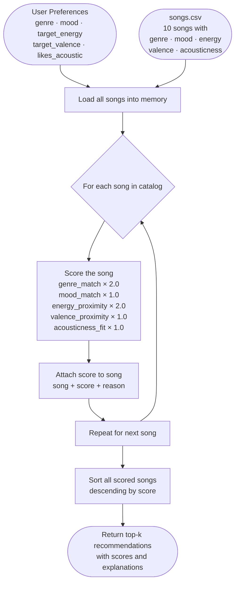

# 🎵 Music Recommender Simulation

## Project Summary

In this project you will build and explain a small music recommender system.

Your goal is to:

- Represent songs and a user "taste profile" as data
- Design a scoring rule that turns that data into recommendations
- Evaluate what your system gets right and wrong
- Reflect on how this mirrors real world AI recommenders

This simulation builds a content-based music recommender that scores songs by measuring how closely their features (genre, mood, energy, valence, acousticness) match a user's stated preferences. It uses a weighted proximity formula so that matching genre counts more than matching mood, and matching mood counts more than numerical closeness on energy or valence.

---

## How The System Works

Real-world recommenders (Spotify, YouTube, Netflix) work by representing both users and content as structured data, then finding the smallest "distance" between them. Spotify's Discover Weekly, for example, combines your listening history with audio features extracted from every track — then surfaces songs that are mathematically close to what you already like, even if you've never heard the artist. Our simulation mirrors that same logic at a small scale: we describe each song with measurable features and describe the user's taste as a set of target values for those same features. A scoring function then measures how close each song is to the user's ideal, and the top-scoring songs become the recommendation.

**What each `Song` stores:**
- `genre` — categorical label (pop, lofi, rock, ambient, synthwave, jazz, indie pop)
- `mood` — categorical label (happy, chill, intense, relaxed, focused, moody)
- `energy` — float 0.0–1.0, overall energy level of the track
- `valence` — float 0.0–1.0, emotional brightness / positivity
- `acousticness` — float 0.0–1.0, acoustic vs. electronic production

**What `UserProfile` stores:**
- `favorite_genre` — the user's preferred genre (categorical)
- `favorite_mood` — the user's preferred mood context (categorical)
- `target_energy` — float 0.0–1.0, their ideal energy level
- `likes_acoustic` — boolean, whether they prefer acoustic production

---

### Algorithm Recipe

The score for a single song is the sum of five weighted signals:

| Signal | Weight | Formula |
|---|---|---|
| Genre match | **+2.0** | `1.0` if `song.genre == user.genre` else `0.0` |
| Mood match | **+1.0** | `1.0` if `song.mood == user.mood` else `0.0` |
| Energy proximity | **+2.0** | `1.0 - abs(song.energy - user.target_energy)` |
| Valence proximity | **+1.0** | `1.0 - abs(song.valence - user.target_valence)` |
| Acousticness fit | **+1.0** | `song.acousticness` if `likes_acoustic` else `1.0 - song.acousticness` |

```
score = (2.0 × genre_match)
      + (1.0 × mood_match)
      + (2.0 × energy_proximity)
      + (1.0 × valence_proximity)
      + (1.0 × acousticness_fit)
```

**Max possible score:** 7.0 (perfect match on all five axes)

**Proximity formula explained:** `1 - |song.value - user.target|` gives 1.0 for a perfect match and decreases linearly toward 0.0 as the song drifts away. This rewards *closeness*, not "higher is better."

**Ranking Rule:** Apply the scoring rule to every song → collect `(song, score)` pairs → sort descending → return top-k. Individual scores are only meaningful in comparison to the rest of the catalog.

---

### Data Flow



---

### Expected Biases

- **Genre over-prioritizes.** A perfect genre match (2.0 pts) can outweigh a strong mood+energy mismatch. A chill lofi song could outscore a perfect-energy happy song just by sharing a genre label.
- **Catalog is too small.** With only 10 songs, a user whose genre isn't represented (e.g. "jazz" lovers) gets poor results even if energy and mood are close.
- **Categorical labels are coarse.** Two songs both labeled `mood: chill` can feel very different (ambient vs. lofi), but the scoring treats them identically.
- **`likes_acoustic` is binary.** A float `target_acousticness` would give finer-grained separation between slightly-acoustic and fully-acoustic songs.

---

## Getting Started

### Setup

1. Create a virtual environment (optional but recommended):

   ```bash
   python -m venv .venv
   source .venv/bin/activate      # Mac or Linux
   .venv\Scripts\activate         # Windows

2. Install dependencies

```bash
pip install -r requirements.txt
```

3. Run the app:

```bash
python -m src.main
```

### Running Tests

Run the starter tests with:

```bash
pytest
```

You can add more tests in `tests/test_recommender.py`.

---

## Reflection

Read and complete `model_card.md`:

[**Model Card**](model_card.md)

Write 1 to 2 paragraphs here about what you learned:

- about how recommenders turn data into predictions
- about where bias or unfairness could show up in systems like this


